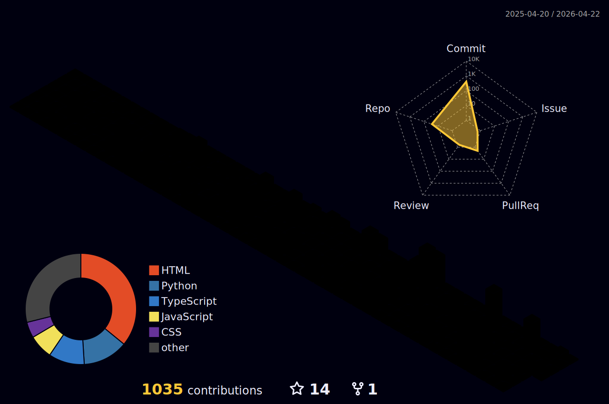

<div align="center">
  

  <div style="position: relative; margin-top: -65px;">
    <a href="https://shalomchidiazuwike.codes/">
      
    </a>
  </div>
</div>

<br />

<div align="center">
  <a href="https://git.io/typing-svg">
    
  </a>
</div>

<br />

<div align="center">
  <p style="font-size: 1.2em; color: #c9d1d9; max-width: 800px; line-height: 1.8; margin: 0 auto;">
      I create apps that bring ideas to life, blending creativity with smart technology. 
      <br>I work with <b>React, Node.js, Python, Flutter, and AI</b> to build things that actually matter.
      <br><br>
      <b>🚀 Building:</b> Uruella AI & KSU Ecosystem &nbsp;|&nbsp; <b>⚡ Repping:</b> Samsung, Interswitch, GDG , Cowrywise & Uruella
      <br><b>🎯 My Goal:</b> Empowering Africa through Technology
  </p>

  <br />

  <p>
    <a href="https://github.com/JaimeCabary">
      
    </a>
    <a href="https://www.linkedin.com/in/shalom-chidi-azuwike-752b47321">
      
    </a>
    <a href="https://x.com/JaimeCabary">
      
    </a>
    <!-- <a href="https://medium.com/@shazzyazuwike">
      
    </a> -->
    <a href="https://shalomchidiazuwike.codes/">
      
    </a>
  </p>
</div>

<br />

<div align="center">
  
  &nbsp;&nbsp;
  
  &nbsp;&nbsp;
  <a href="https://zeptaherself.netlify.app/My%20Standard%20Resume.pdf">
    
  </a>
</div>

<br />

---

<h2 align="center">
  
  <span style="color: #FF4500;">DIGITAL ARCHITECTURE</span>
  
</h2>

<div align="center">
  
</div>

<br />

<h2 align="center">
  
  <span style="color:  #FF4500;">NEURAL NETWORK ACTIVITY</span>
  
</h2>

<div align="center">
   <!-- <picture>
    <source media="(prefers-color-scheme: dark)" srcset="https://raw.githubusercontent.com/JaimeCabary/JaimeCabary/output/pacman-contribution-graph-dark.svg">
    <source media="(prefers-color-scheme: light)" srcset="https://raw.githubusercontent.com/JaimeCabary/JaimeCabary/output/pacman-contribution-graph.svg">
    
  </picture> -->
  
  <br /><br />
  
  <picture>
    <source media="(prefers-color-scheme: dark)" srcset="https://github.com/JaimeCabary/JaimeCabary/raw/output/github-contribution-grid-snake-dark.svg">
    <source media="(prefers-color-scheme: light)" srcset="https://github.com/JaimeCabary/JaimeCabary/raw/output/github-contribution-grid-snake. svg">
    
  </picture>
</div>

<br />

<div align="center">
  
</div>

<br />

---

<h2 align="center">
  
  <span style="color:#FF4500;">TECH ARSENAL</span>
  
</h2>

<div align="center">

  <h3>🐍 Core Language</h3>
  

  <h3>⚡ Other Languages</h3>
  

  <h3>🚀 Frameworks & Libraries</h3>
  

  <h3>🗄️ Databases, ORMs & Backend Services</h3>
  

  <h3>🛠️ Tools & Platforms</h3>
  

  <h3>⚙️ Build & Dev Tooling</h3>
  

</div>

<br />

<!-- <h2 align="center">
  
  <span style="color:  #FF4500;">HALL OF FAME</span>
  
</h2>

<div align="center">
  <a href="https://github.com/ryo-ma/github-profile-trophy">
    
  </a>
</div> -->
<h2 align="center">
  
  <span style="color:  #FF4500;">HALL OF FAME</span>
  
</h2>
<div align="center">
  
</div>
<br />

<!-- <div align="center">
  
  <br /><br />
  
  
  
</div> -->

<!-- <div align="center">
  
  <br /><br />
  
  
  
</div> -->

<div align="center">
  
  <br /><br />
  
  
  
</div>

<br />

---

<!-- <h2 align="center">
  
  <span style="color: #FF4500;">SYSTEM METRICS</span>
  
</h2>

<div align="center">
  <table style="border:  none; background-color: transparent; width: 100%;">
    <tr>
      <td width="50%" align="center" valign="top">
        <a href="https://github.com/JaimeCabary">
          
        </a>
      </td>
      <td width="50%" align="center" valign="top">
        <a href="https://github.com/JaimeCabary">
          
        </a>
      </td>
    </tr>
  </table>
  
  <br />
  
  <a href="https://github.com/JaimeCabary">
    
  </a> -->
<!-- <h2 align="center">
  
  <span style="color: #FF4500;">SYSTEM METRICS</span>
  
</h2>
<div align="center">
  <table style="border: none; background-color: transparent; width: 100%;">
    <tr>
      <td width="50%" align="center" valign="top">
        <a href="https://github.com/JaimeCabary">
          
        </a>
      </td>
      <td width="50%" align="center" valign="top">
        <a href="https://github.com/JaimeCabary">
          
        </a>
      </td>
    </tr>
  </table>
  
  <br />
  
  <a href="https://github.com/JaimeCabary">
    
  </a>

  <br /><br />
  
  
 </div> -->

<!-- <h2 align="center">
  
  <span style="color: #FF4500;">SYSTEM METRICS</span>
  
</h2>
<div align="center">
  
</div> -->

<!-- SYSTEM METRICS SECTION -->
<!-- <h2 align="center">
  
  <span style="color: #FF4500;">SYSTEM METRICS</span>
  
</h2> -->

<!-- Option 1: Use Locally Generated Metrics (Most Reliable) -->
<!-- <div align="center">
  
  <br /><br />
  
  
</div> -->

<!-- <br /> -->

<br />

<h2 align="center">
  
  <span style="color: #FF4500;">DEPLOYED ARCHIVES</span>
  
</h2>

<table width="100%">
  <tr>
    <!-- Pure Cinema -->
    <td width="50%" valign="top">
      <div align="center" style="border:2px solid #FF4500;border-radius:15px;padding:15px;background:linear-gradient(135deg,#0d1117 0%,#161b22 100%);box-shadow:0 8px 20px rgba(255,69,0,.4);">
        <a href="https://purecinema.vercel.app">
          
        </a>
        <br><br>
        <h3 style="color:#FF4500;margin:10px 0;">🎬 Pure Cinema</h3>
        <p style="color:#8b949e;font-size:13px;">
          
          
        </p>
        <p style="color:#c9d1d9;font-size:14px;line-height:1.6;">
          Cinematic streaming architecture respecting director intent
        </p>
      </div>
    </td>
    <td width="50%" valign="top">
      <div align="center" style="border:2px solid #FF4500;border-radius:15px;padding:15px;background:linear-gradient(135deg,#0d1117 0%,#161b22 100%);box-shadow:0 8px 20px rgba(255,69,0,.4);">
        <a href="https://uruella.vercel.app">
          
        </a>
        <br><br>
        <h3 style="color:#FF4500;margin:10px 0;">🤖 Uruella AI</h3>
        <p style="color:#8b949e;font-size:13px;">
          
          
        </p>
        <p style="color:#c9d1d9;font-size:14px;line-height:1.6;">
          Offline-first intelligence for zero-latency environments
        </p>
      </div>
    </td>
  </tr>

  <tr><td colspan="2"><br></td></tr>

  <tr>
    <!-- Calculus -->
    <td width="50%" valign="top">
      <div align="center" style="border:1px solid #30363d;border-radius:12px;padding:12px;background:#161b22;">
        <a href="https://calculuss.vercel.app">
          
        </a>
        <br><br>
        <h4 style="color:#c9d1d9;">➗ Calculus</h4>
        <p style="color:#8b949e;font-size:12px;">
          TypeScript • Mathematical Engine
        </p>
      </div>
    </td>
    <td width="50%" valign="top">
      <div align="center" style="border:1px solid #30363d;border-radius:12px;padding:12px;background:#161b22;">
        <a href="#">
          
        </a>
        <br><br>
        <h4 style="color:#c9d1d9;">🪐 MarsoVerse</h4>
        <p style="color:#8b949e;font-size:12px;">
          WebGL • Three.js • Exploration
        </p>
      </div>
    </td>
  </tr>

  <tr><td colspan="2"><br></td></tr>

  <tr>
    <!-- Totum OS -->
    <td width="50%" valign="top">
      <div align="center" style="border:1px solid #30363d;border-radius:12px;padding:12px;background:#161b22;">
        <a href="https://new-totum.vercel.app">
          
        </a>
        <br><br>
        <h4 style="color:#c9d1d9;">🧠 Totum OS</h4>
        <p style="color:#8b949e;font-size:12px;">
          Browser-level operating system simulation
        </p>
      </div>
    </td>
    <td width="50%" valign="top">
      <div align="center" style="border:1px solid #30363d;border-radius:12px;padding:12px;background:#161b22;">
        <a href="https://gmutliepod.vercel.app">
          
        </a>
        <br><br>
        <h4 style="color:#c9d1d9;">🎧 G-Mutliepod</h4>
        <p style="color:#8b949e;font-size:12px;">
          Advanced media pod architecture
        </p>
      </div>
    </td>
  </tr>

  <tr><td colspan="2"><br></td></tr>

  <tr>
    <!-- Reigning Life -->
    <td width="50%" valign="top">
      <div align="center" style="border:1px solid #30363d;border-radius:12px;padding:12px;background:#161b22;">
        <a href="https://reigninglife.netlify.app/">
          
        </a>
        <br><br>
        <h4 style="color:#c9d1d9;">🏫 Reigning Life School</h4>
        <p style="color:#8b949e;font-size:12px;">
          Full-stack school management system
        </p>
      </div>
    </td>
  </tr>
</table>

<br>

---

<h2 align="center">
  
  <span style="color: #FF4500;">TESTIMONIALS</span>
</h2>

<div align="center">
  <table width="95%">
    <tr>
      <td width="50%" valign="top" style="padding: 15px;">
        <div style="background: linear-gradient(135deg, #161b22 0%, #0d1117 100%); border-left: 5px solid #FF4500; border-radius: 10px; padding: 20px; box-shadow: 0 4px 15px rgba(255, 69, 0, 0.3);">
          <p style="color: #c9d1d9; font-style: italic; font-size: 14px; line-height: 1.7;">
            "Shalom delivered an exceptional website that exceeded all expectations.  Her technical skills combined with creative design sense made our project a huge success."
          </p>
          <p style="color: #FF4500; font-size: 13px; margin-top: 15px; font-weight: bold;">
            — Dr. Sarah Echefu
            <br />
            <span style="color: #8b949e; font-size: 11px; font-weight: normal;">CEO, TechVision Solutions</span>
          </p>
        </div>
      </td>
      <td width="50%" valign="top" style="padding: 15px;">
        <div style="background: linear-gradient(135deg, #161b22 0%, #0d1117 100%); border-left: 5px solid #FF4500; border-radius: 10px; padding: 20px; box-shadow: 0 4px 15px rgba(255, 69, 0, 0.3);">
          <p style="color: #c9d1d9; font-style: italic; font-size: 14px; line-height: 1.7;">
            "She built our business management app with incredible attention to detail and user experience.  Highly professional and innovative!"
          </p>
          <p style="color: #FF4500; font-size: 13px; margin-top: 15px; font-weight: bold;">
            — Emmanuel Stanley
            <br />
            <span style="color: #8b949e; font-size: 11px; font-weight: normal;">Director, Digital Dynamics</span>
          </p>
        </div>
      </td>
    </tr>
  </table>
</div>

<br />

---

<h2 align="center">
  
  <span style="color: #FF4500;">LATEST ACTIVITY</span>
</h2>


  
<!--START_SECTION:waka-->

```python
From: 09 January 2026 - To: 14 February 2026

Total Time: 0 secs

No activity tracked
```

<!--END_SECTION:waka-->

</div>

<br />

---

<h2 align="center">
  
  <span style="color: #FF4500;">LATEST BLOG POSTS</span>
  
</h2>

<div align="center">
  

- [Tunnelling In.](https://medium.com/@shazzyazuwike/tunnelling-in-bcc1c8c3ba0b?source=rss-38ac1d46254f------2)
- [Don't Lose Yourself.](https://medium.com/@shazzyazuwike/-0b071ef0d3fa?source=rss-38ac1d46254f------2)
- [Mark of the Singularity: The Genesis of SudoCat](https://medium.com/@shazzyazuwike/mark-of-the-singularity-the-genesis-of-sudocat-553a8bd33ccb?source=rss-38ac1d46254f------2)


</div>

<br />

<h2 align="center">
  
  <span style="color: #FF4500;">GLOBAL CONNECTIONS</span>
</h2>

<div align="center">
  
</div>

<br />


<div align="center">
  <h2 style="color: #FF4500;">
    
    Let's Connect and Build Something Amazing! 
    
  </h2>
  
  <p style="font-size: 16px; color: #c9d1d9;">
    💼 Open for collaborations and innovative projects<br />
    📧 Email: <a href="mailto:shazzyazuwike@gmail.com" style="color: #FF4500;">shazzyazuwike@gmail.com</a><br />
    🌐 Portfolio: <a href="https://shacodone.vercel. app/" style="color: #FF4500;">shalomchidiazuwike.codes</a>
  </p>
  
  <br />
  
  
</div>

<!-- <div align="center">
  
</div> -->


<!-- <h2 align="center">
  
  <span style="color: #FF4500;">ALLIANCE MEMBERS</span>
</h2>

<div align="center">
  <a href="https://github.com/JaimeCabary/Uruella-AI/stargazers">
    
  </a>
  <br /><br />
  <a href="https://github.com/JaimeCabary/Uruella-AI/network/members">
    
  </a>
</div>

<br /> -->


<!-- <div align="center"> -->

<!-- BLOG-POST-LIST: START -->
<!-- BLOG-POST-LIST:END -->
<!-- </div> -->

<!-- <div align="center">
  

  <div style="position: relative; margin-top: -65px;">
    <a href="https://shalomchidiazuwike.codes/">
      
    </a>
  </div>
</div>

<div align="center">
  <a href="https://git.io/typing-svg">
    
  </a>
</div>

<br />

<div align="center">
  <p style="font-size: 1.1em; color: #c9d1d9; max-width: 750px; line-height: 1.8;">
    I build immersive applications that bridge the gap between human creativity and machine intelligence. Specializing in the <b>MERN Stack, Python, and AI</b>.
    <br><br>
    <b>🚀 Founder:</b> Uruella AI & KSU Ecosystem &nbsp;|&nbsp; <b>⚡ Ambassador:</b> Samsung & Microsoft Learn
  </p>

  <p>
    <a href="https://github.com/JaimeCabary"></a>
    <a href="https://www.linkedin.com/in/shalom-chidi-azuwike-752b47321"></a>
    <a href="https://x.com/JaimeCabary"></a>
    <a href="https://medium.com/@shazzyazuwike"></a>
    <a href="https://shalomchidiazuwike.codes/"></a>
  </p>
</div>

<br />

<div align="center">
  
  &nbsp;
  <a href="https://zeptaherself.netlify.app/My%20Standard%20Resume.pdf">
    
  </a>
</div>

<h2 align="center" style="color: #FF4500; border-bottom: 2px solid #FF4500;">🌆 DIGITAL ARCHITECTURE</h2>
<div align="center">
  
</div>

<h2 align="center" style="color: #FF4500;">🕹️ NEURAL NETWORK</h2>
<div align="center">
  <picture>
    <source media="(prefers-color-scheme: dark)" srcset="https://raw.githubusercontent.com/JaimeCabary/JaimeCabary/output/pacman-contribution-graph-dark.svg">
    <source media="(prefers-color-scheme: light)" srcset="https://raw.githubusercontent.com/JaimeCabary/JaimeCabary/output/pacman-contribution-graph.svg">
    
  </picture>
  <br><br>
  <picture>
    <source media="(prefers-color-scheme: dark)" srcset="https://github.com/JaimeCabary/JaimeCabary/raw/output/github-contribution-grid-snake-dark.svg">
    <source media="(prefers-color-scheme: light)" srcset="https://github.com/JaimeCabary/JaimeCabary/raw/output/github-contribution-grid-snake.svg">
    
  </picture>
</div>

<div align="center">
  
</div>

<h3 align="center" style="color: #FF4500;">🏆 HALL OF FAME & DOSSIERS</h3>
<div align="center">
  <a href="https://github.com/ryo-ma/github-profile-trophy">
    
  </a>
  <br><br>
  
  <br>
  
  
</div>

<br />

<h3 align="center" style="color: #FF4500;">🛠️ TECH ARSENAL</h3>
<div align="center">
  
</div>

<h2 align="center" style="color: #FF4500; border-bottom: 2px solid #FF4500;">❄️ SYSTEM METRICS</h2>
<br>
<div align="center">
  <table style="border: none; background-color: transparent; width: 100%;">
    <tr>
      <td width="55%" align="center" style="padding: 5px;">
        <a href="https://github.com/JaimeCabary">
          
        </a>
      </td>
      <td width="45%" align="center" style="padding: 5px;">
        <a href="https://github.com/JaimeCabary">
          
        </a>
      </td>
    </tr>
  </table>
  <br>
  <a href="https://github.com/JaimeCabary">
    
  </a>
  <br>
  
</div>

<br />

<h2 align="center" style="color: #FF4500;">⏳ CHRONO-METRICS</h2>
<div align="center">
  </div>
<br>

<h2 align="center" style="color: #FF4500; border-bottom: 2px solid #FF4500;">🎁 DEPLOYED ARCHIVES</h2>
<br>
<table border="0" width="100%">
  <tr>
    <td width="50%" valign="top" style="padding: 10px;">
      <div align="center" style="border: 1px solid #FF4500; border-radius: 12px; padding: 10px; background-color: #161b22; box-shadow: 0 4px 15px rgba(255, 69, 0, 0.3);">
        <a href="https://github.com/JaimeCabary"></a>
        <br><br>
        <b style="color: #FF4500; font-size: 16px;">Uruella AI (Latest)</b>
        <br>
        <span style="color: #8b949e; font-size: 12px;">Offline-First AI Assistant • Flutter</span>
      </div>
    </td>
    <td width="50%" valign="top" style="padding: 10px;">
      <div align="center" style="border: 1px solid #FF4500; border-radius: 12px; padding: 10px; background-color: #161b22; box-shadow: 0 4px 15px rgba(255, 69, 0, 0.3);">
        <a href="https://github.com/JaimeCabary"></a>
        <br><br>
        <b style="color: #FF4500; font-size: 16px;">Totum (Latest)</b>
        <br>
        <span style="color: #8b949e; font-size: 12px;">Next Gen Software Solution</span>
      </div>
    </td>
  </tr>
  <tr>
    <td width="50%" valign="top" style="padding: 10px;">
      <div align="center" style="border: 1px solid #30363d; border-radius: 12px; padding: 10px; background-color: #161b22;">
        <a href="https://zeptaherself.netlify.app/#projects"></a>
        <br><br>
        <b style="color: #c9d1d9; font-size: 16px;">Janessa AI Chatbot</b>
        <br>
        <span style="color: #8b949e; font-size: 12px;">Python Flask • NLP Integration</span>
      </div>
    </td>
    <td width="50%" valign="top" style="padding: 10px;">
      <div align="center" style="border: 1px solid #30363d; border-radius: 12px; padding: 10px; background-color: #161b22;">
        <a href="https://reigninglife.netlify.app/"></a>
        <br><br>
        <b style="color: #c9d1d9; font-size: 16px;">R.L. School System</b>
        <br>
        <span style="color: #8b949e; font-size: 12px;">Full Stack Portal • Auth Systems</span>
      </div>
    </td>
  </tr>
  <tr>
    <td width="50%" valign="top" style="padding: 10px;">
      <div align="center" style="border: 1px solid #30363d; border-radius: 12px; padding: 10px; background-color: #161b22;">
        <a href="https://unzep.netlify.app/"></a>
        <br><br>
        <b style="color: #c9d1d9; font-size: 16px;">UN Website Revamp</b>
        <br>
        <span style="color: #8b949e; font-size: 12px;">React • FastAPI • Global Impact</span>
      </div>
    </td>
    <td width="50%" valign="top" style="padding: 10px;">
      <div align="center" style="border: 1px solid #30363d; border-radius: 12px; padding: 10px; background-color: #161b22;">
        <a href="https://nkmedicals.netlify.app/"></a>
        <br><br>
        <b style="color: #c9d1d9; font-size: 16px;">Lude Health Centre</b>
        <br>
        <span style="color: #8b949e; font-size: 12px;">IEEE Sponsored • Hospital Management</span>
      </div>
    </td>
  </tr>
</table>

<br />

<h3 align="center" style="color: #FF4500;">💬 ENDORSEMENTS</h3>
<div style="background-color: #161b22; border: 1px solid #FF4500; border-left: 8px solid #FF4500; padding: 20px; border-radius: 6px; margin-bottom: 15px; box-shadow: 0 0 10px rgba(255, 69, 0, 0.2);">
  <p style="color: #c9d1d9; font-style: italic; margin: 0; font-size: 14px;">"Shalom delivered an exceptional website... Her technical skills combined with creative design sense made our project a huge success."</p>
  <p style="color: #8b949e; font-size: 12px; margin: 10px 0 0 0; font-weight: bold; text-transform: uppercase;">— Dr. Sarah Echefu, CEO, TechVision Solutions</p>
</div>
<div style="background-color: #161b22; border: 1px solid #FF4500; border-left: 8px solid #c9d1d9; padding: 20px; border-radius: 6px; box-shadow: 0 0 10px rgba(255, 255, 255, 0.2);">
  <p style="color: #c9d1d9; font-style: italic; margin: 0; font-size: 14px;">"She built our business management app with incredible attention to detail and user experience."</p>
  <p style="color: #8b949e; font-size: 12px; margin: 10px 0 0 0; font-weight: bold; text-transform: uppercase;">— Emmanuel Stanley, Director, Digital Dynamics</p>
</div>

<br />

<h2 align="center" style="color: #FF4500;">🌍 GLOBAL CONNECTIONS</h2>
<div align="center">
  
</div>
<br>
<h2 align="center" style="color: #FF4500;">🤝 ALLIANCE MEMBERS</h2>
<div align="center">
  <a href="https://github.com/JaimeCabary/Uruella-AI/stargazers">
    
  </a>
</div>

<br />

<div align="center">
  
</div>


<!-- <div align="center">
  <a href="https://git.io/typing-svg">
    
  </a>
  <br />
  

  <div style="position: relative; margin-top: -65px;">
    
  </div>
</div>

<br />

<div align="center">
  
  
  <p style="font-size: 1.1em; color: #c9d1d9; max-width: 750px; line-height: 1.8;">
    I build immersive applications that bridge the gap between human creativity and machine intelligence. Specializing in the <b>MERN Stack, Python, and AI</b>.
    <br><br>
    <b>🚀 Founder:</b> Uruella AI & KSU Ecosystem &nbsp;|&nbsp; <b>⚡ Ambassador:</b> Samsung & Microsoft Learn
  </p>

  <p>
    <a href="https://github.com/JaimeCabary"></a>
    <a href="https://www.linkedin.com/in/shalom-chidi-azuwike-752b47321"></a>
    <a href="https://x.com/JaimeCabary"></a>
    <a href="https://medium.com/@shazzyazuwike"></a>
    <a href="https://shalomchidiazuwike.codes/"></a>
  </p>
</div>

<br />

<div align="center">
 
  
  <a href="https://zeptaherself.netlify.app/My%20Standard%20Resume.pdf">
    
  </a>
</div>

<h2 align="center" style="color: #D42426; border-bottom: 2px solid #228B22;">🕹️ WINTER ARCADE</h2>
<div align="center">
  <picture>
    <source media="(prefers-color-scheme: dark)" srcset="https://raw.githubusercontent.com/JaimeCabary/JaimeCabary/output/pacman-contribution-graph-dark.svg">
    <source media="(prefers-color-scheme: light)" srcset="https://raw.githubusercontent.com/JaimeCabary/JaimeCabary/output/pacman-contribution-graph.svg">
    
  </picture>

  <br><br>

  <picture>
    <source media="(prefers-color-scheme: dark)" srcset="https://github.com/JaimeCabary/JaimeCabary/raw/output/github-contribution-grid-snake-dark.svg">
    <source media="(prefers-color-scheme: light)" srcset="https://github.com/JaimeCabary/JaimeCabary/raw/output/github-contribution-grid-snake.svg">
    
  </picture>
</div>

<br />

<h3 align="center" style="color: #D42426;">🏆 HALL OF FAME</h3>
<div align="center">
  <a href="https://github.com/ryo-ma/github-profile-trophy">
    
  </a>
  <br><br>
  
</div>

<br />

<h3 align="center" style="color: #228B22;">🛠️ SANTA'S WORKSHOP (TECH STACK)</h3>
<div align="center">
  
</div>

<br /><br />

<h2 align="center" style="color: #D42426; border-bottom: 2px solid #228B22;">❄️ SYSTEM METRICS</h2>
<br>

<div align="center">
  <table style="border: none; background-color: transparent; width: 100%;">
    <tr>
      <td width="55%" align="center" style="padding: 5px;">
        <a href="https://github.com/JaimeCabary">
          
        </a>
      </td>
      <td width="45%" align="center" style="padding: 5px;">
        <a href="https://github.com/JaimeCabary">
          
        </a>
      </td>
    </tr>
  </table>
  
  <br>
  <a href="https://github.com/JaimeCabary">
    
  </a>
</div>

<br /><br />

<h2 align="center" style="color: #D42426; border-bottom: 2px solid #228B22;">🎁 DEPLOYED ARCHIVES</h2>
<br>

<table border="0" width="100%">
  <tr>
    <td width="50%" valign="top" style="padding: 10px;">
      <div align="center" style="border: 1px solid #D42426; border-radius: 12px; padding: 10px; background-color: #161b22; box-shadow: 0 4px 15px rgba(212, 36, 38, 0.3);">
        <a href="https://github.com/JaimeCabary"></a>
        <br><br>
        <b style="color: #D42426; font-size: 16px;">Uruella AI (Latest)</b>
        <br>
        <span style="color: #8b949e; font-size: 12px;">Offline-First AI Assistant • Flutter</span>
      </div>
    </td>
    <td width="50%" valign="top" style="padding: 10px;">
      <div align="center" style="border: 1px solid #228B22; border-radius: 12px; padding: 10px; background-color: #161b22; box-shadow: 0 4px 15px rgba(34, 139, 34, 0.3);">
        <a href="https://github.com/JaimeCabary"></a>
        <br><br>
        <b style="color: #228B22; font-size: 16px;">Totum (Latest)</b>
        <br>
        <span style="color: #8b949e; font-size: 12px;">Next Gen Software Solution</span>
      </div>
    </td>
  </tr>
  
  <tr>
    <td width="50%" valign="top" style="padding: 10px;">
      <div align="center" style="border: 1px solid #30363d; border-radius: 12px; padding: 10px; background-color: #161b22;">
        <a href="https://zeptaherself.netlify.app/#projects"></a>
        <br><br>
        <b style="color: #c9d1d9; font-size: 16px;">Janessa AI Chatbot</b>
        <br>
        <span style="color: #8b949e; font-size: 12px;">Python Flask • NLP Integration</span>
      </div>
    </td>
    <td width="50%" valign="top" style="padding: 10px;">
      <div align="center" style="border: 1px solid #30363d; border-radius: 12px; padding: 10px; background-color: #161b22;">
        <a href="https://reigninglife.netlify.app/"></a>
        <br><br>
        <b style="color: #c9d1d9; font-size: 16px;">R.L. School System</b>
        <br>
        <span style="color: #8b949e; font-size: 12px;">Full Stack Portal • Auth Systems</span>
      </div>
    </td>
  </tr>
  
  <tr>
    <td width="50%" valign="top" style="padding: 10px;">
      <div align="center" style="border: 1px solid #30363d; border-radius: 12px; padding: 10px; background-color: #161b22;">
        <a href="https://unzep.netlify.app/"></a>
        <br><br>
        <b style="color: #c9d1d9; font-size: 16px;">UN Website Revamp</b>
        <br>
        <span style="color: #8b949e; font-size: 12px;">React • FastAPI • Global Impact</span>
      </div>
    </td>
    <td width="50%" valign="top" style="padding: 10px;">
      <div align="center" style="border: 1px solid #30363d; border-radius: 12px; padding: 10px; background-color: #161b22;">
        <a href="https://nkmedicals.netlify.app/"></a>
        <br><br>
        <b style="color: #c9d1d9; font-size: 16px;">Lude Health Centre</b>
        <br>
        <span style="color: #8b949e; font-size: 12px;">IEEE Sponsored • Hospital Management</span>
      </div>
    </td>
  </tr>
</table>

<br /><br />

<!-- <div align="center" style="border: 1px solid #228B22; border-radius: 10px; padding: 20px; background-color: #161b22; width: 90%;">
  <h3 style="color: #D42426; margin-bottom: 10px;">💼 CAREER TRAJECTORY (THE NICE LIST)</h3>
  <ul style="text-align: left; color: #c9d1d9; list-style-type: square; margin: 0 auto; display: inline-block;">
    <li style="margin-bottom: 10px;">
      <b>Founder Uruella</b> <i>(2019 - Present)</i><br>
      Leading 20+ bespoke AI & MERN solutions.
    </li>
    <li style="margin-bottom: 10px;">
      <b>Microsoft Learn Student Ambassador</b> <i>(2023 - 2025)</i><br>
      Mentored 50+ students in Azure & Python.
    </li>
    <li style="margin-bottom: 10px;">
      <b>Samsung Student Ambassador</b> <i>(2024 - Present)</i><br>
      Driving campus tech activation.
    </li>
    <li>
      <b>IEEE FUTO Student Secretary</b> <i>(2025)</i><br>
      Organized humanitarian tech initiatives.
    </li>
  </ul>
</div> 

<!-- <br /> -->

<!-- <h3 align="center" style="color: #D42426;">💬 ENDORSEMENTS</h3>
<div style="background-color: #161b22; border: 1px solid #D42426; border-left: 8px solid #228B22; padding: 20px; border-radius: 6px; margin-bottom: 15px; box-shadow: 0 0 10px rgba(212, 36, 38, 0.2);">
  <p style="color: #c9d1d9; font-style: italic; margin: 0; font-size: 14px;">"Shalom delivered an exceptional website... Her technical skills combined with creative design sense made our project a huge success."</p>
  <p style="color: #8b949e; font-size: 12px; margin: 10px 0 0 0; font-weight: bold; text-transform: uppercase;">— Dr. Sarah Echefu, CEO, TechVision Solutions</p>
</div>

<div style="background-color: #161b22; border: 1px solid #228B22; border-left: 8px solid #D42426; padding: 20px; border-radius: 6px; box-shadow: 0 0 10px rgba(34, 139, 34, 0.2);">
  <p style="color: #c9d1d9; font-style: italic; margin: 0; font-size: 14px;">"She built our business management app with incredible attention to detail and user experience."</p>
  <p style="color: #8b949e; font-size: 12px; margin: 10px 0 0 0; font-weight: bold; text-transform: uppercase;">— Emmanuel Stanley, Director, Digital Dynamics</p>
</div>

<br /><br />

<div align="center">
  
</div> -->
