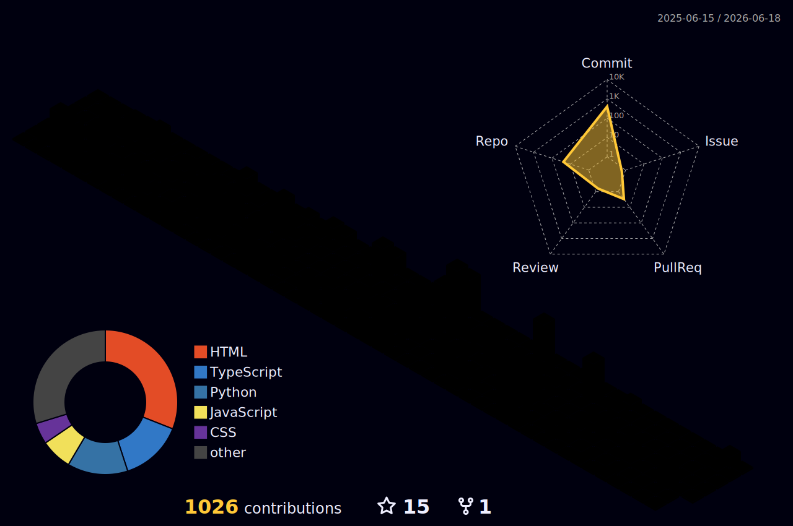

<div align="center">
 

  <div style="position: relative; margin-top: -65px;">
    <a href="https://shalomchidiazuwike.codes/">
      
    </a>
  </div>
</div>

<br />

<div align="center">
  <a href="https://git.io/typing-svg">

  </a>
</div>

<br />

<div align="center">
<p style="font-size: 1.2em; color: #c9d1d9; max-width: 800px; line-height: 1.8; margin: 0 auto;">
    Final-year Software Engineering student shippingreal things. 
    <br><br>
    Right now, I'm building <b>Concaretti</b>—a multi-agent platform where AI models pass tasks back and forth like a real team, instead of one model trying to do it all alone. I founded <b>Heccker OS -  </b> An ambient, high-agency intelligence built with Google ADK, fusing zero-trust execution with personalized swarm orchestration. I also co-founded <b>CampUstore</b>, a campus marketplace where students can buy, sell, and hire each other.
    <br><br>
    <b>⚡ Leadership:</b> IEEE IES Ambassador &nbsp;|&nbsp; Samsung Student Ambassador &nbsp;|&nbsp; GDG FUTO Content Lead
    <br><b>🎙️ Creative side:</b> Professional voice actor &nbsp;|&nbsp; ArchiCAD child prodigy
    <br><b>📡 Off the clock:</b> Speedcubing, writing a novel called <i>Twin</i>,<!-- Pen name: Aster L. Nowen --> and reading way too much about how brains and markets predict the future.
</p>


  <br />

  <p>
    <a href="https://github.com/JaimeCabary">
      
    </a>
    <a href="https://www.linkedin.com/in/shalom-chidi-azuwike-752b47321">
      
    </a>
    <a href="https://x.com/JaimeCabary">
      
    </a>
    <a href="https://shalomchidiazuwike.codes/">
      
    </a>
  </p>
</div>

<br />

<div align="center">
  
  &nbsp;&nbsp;
  
  &nbsp;&nbsp;
  <a href="https://www.shalomchidiazuwike.codes/CV/Shalom%20Ebere%20Chidi-Azuwike%20DarkMode%20Resume.pdf">
    
  </a>
</div>

<br />

---

<h2 align="center">
  
  <span style="color: #FF4500;">DIGITAL ARCHITECTURE</span>
  
</h2>

<div align="center">
  
</div>

<br />

<h2 align="center">
  
  <span style="color:  #FF4500;">NEURAL NETWORK ACTIVITY</span>
  
</h2>

<div align="center">
  <br /><br />
  
  <picture>
    <source media="(prefers-color-scheme: dark)" srcset="https://github.com/JaimeCabary/JaimeCabary/raw/output/github-contribution-grid-snake-dark.svg">
    <source media="(prefers-color-scheme: light)" srcset="https://github.com/JaimeCabary/JaimeCabary/raw/output/github-contribution-grid-snake.svg">
    
  </picture>
</div>

<br />

<div align="center">
  
</div>

<br />

---

<h2 align="center">
  
  <span style="color:#FF4500;">TECH ARSENAL</span>
  
</h2>

<div align="center">

  <h3>🐍 Core Languages</h3>
  

  <h3>📱 App & Web Frameworks</h3>
  
  <br/><br/>
  
  

  <h3>🤖 AI & Agent Tooling</h3>
  
  
  
  

  <h3>🗄️ Databases & Backend Services</h3>
  

  <h3>🛠️ DevOps & Tooling</h3>
  

  <h3>🎮 Game Dev, 3D & Native</h3>
  

  <h3>🏛️ Design & Drafting</h3>
  

  <h3>🎙️ Creative & Media</h3>
  
  
  

</div>

<br />

<h2 align="center">
  
  <span style="color:  #FF4500;">BACKGROUND PROCESSES</span>
  
</h2>

<div align="center">

* **Voice Acting**: Professional, books roles as other people's characters.
* **ArchiCAD**: Child prodigy, drafting before it was a hobby.
* **Fiction**: Writing a novel called "Twin". <!-- Pen name: Aster L. Nowen -->
* **Speedcubing**: Still chasing a better single-solve time.
* **Reading List**: Brain science, markets, and theology.
* **Community**: Runs a book club and an anonymous student helpline.
* **Status**: Always compiling something.


</div>

<br />

<h2 align="center">
  
  <span style="color:  #FF4500;">HALL OF FAME</span>
  
</h2>
<div align="center">
  
</div>
<br />

<div align="center">
  
  <br /><br />
  
  
  
</div>

<br />

---

<br />

<h2 align="center">
  
  <span style="color: #FF4500;">DEPLOYED ARCHIVES</span>
  
</h2>

<table width="100%">
  <tr>
    <!-- CampUstore -->
    <td width="50%" valign="top">
      <div align="center" style="border:2px solid #FF4500;border-radius:15px;padding:15px;background:linear-gradient(135deg,#0d1117 0%,#161b22 100%);box-shadow:0 8px 20px rgba(255,69,0,.4);">
        <a href="https://campustoreholdings.vercel.app">
          
        </a>
        <br><br>
        <h3 style="color:#FF4500;margin:10px 0;">📔 CampUstore</h3>
        <p style="color:#8b949e;font-size:13px;">
          
          
        </p>
        <p style="color:#c9d1d9;font-size:14px;line-height:1.6;">
          The student marketplace for buying, selling, and offering services on your campus.
        </p>
      </div>
    </td>
    <!-- Pure Cinema -->
    <td width="50%" valign="top">
      <div align="center" style="border:2px solid #FF4500;border-radius:15px;padding:15px;background:linear-gradient(135deg,#0d1117 0%,#161b22 100%);box-shadow:0 8px 20px rgba(255,69,0,.4);">
        <a href="https://purecinema.vercel.app">
          
        </a>
        <br><br>
        <h3 style="color:#FF4500;margin:10px 0;">🎬 Pure Cinema</h3>
        <p style="color:#8b949e;font-size:13px;">
          
          
        </p>
        <p style="color:#c9d1d9;font-size:14px;line-height:1.6;">
          Cinematic streaming architecture respecting director intent
        </p>
      </div>
    </td>
  </tr>

  <tr><td colspan="2"><br></td></tr>

  <tr>
    <!-- Uruella AI (flagship) -->
    <td width="50%" valign="top">
      <div align="center" style="border:2px solid #FF4500;border-radius:15px;padding:15px;background:linear-gradient(135deg,#0d1117 0%,#161b22 100%);box-shadow:0 8px 20px rgba(255,69,0,.4);">
        <a href="https://uruellaai.vercel.app">
          
        </a>
        <br><br>
        <h3 style="color:#FF4500;margin:10px 0;">🤖 Uruella AI</h3>
        <p style="color:#8b949e;font-size:13px;">
          
          
        </p>
        <p style="color:#c9d1d9;font-size:14px;line-height:1.6;">
          Offline-first intelligence for zero-latency environments
        </p>
      </div>
    </td>
    <!-- G-Mutliepod -->
    <td width="50%" valign="top">
      <div align="center" style="border:1px solid #30363d;border-radius:12px;padding:12px;background:#161b22;">
        <a href="https://gmutliepod.vercel.app">
          
        </a>
        <br><br>
        <h4 style="color:#c9d1d9;">🎧 G-Mutliepod</h4>
        <p style="color:#8b949e;font-size:12px;">
          Advanced media pod architecture
        </p>
      </div>
    </td>
  </tr>

  <tr><td colspan="2"><br></td></tr>

  <tr>
    <!-- Calculus -->
    <td width="50%" valign="top">
      <div align="center" style="border:1px solid #30363d;border-radius:12px;padding:12px;background:#161b22;">
        <a href="https://calculuss.vercel.app">
          
        </a>
        <br><br>
        <h4 style="color:#c9d1d9;">➗ Calculus</h4>
        <p style="color:#8b949e;font-size:12px;">
          TypeScript • Mathematical Engine
        </p>
      </div>
    </td>
    <!-- MarsoVerse -->
    <td width="50%" valign="top">
      <div align="center" style="border:1px solid #30363d;border-radius:12px;padding:12px;background:#161b22;">
        <a href="https://marsoverse.netlify.app">
          
        </a>
        <br><br>
        <h4 style="color:#c9d1d9;">🪐 MarsoVerse</h4>
        <p style="color:#8b949e;font-size:12px;">
          WebGL • Three.js • Exploration
        </p>
      </div>
    </td>
  </tr>

  <tr><td colspan="2"><br></td></tr>

  <tr>
    <!-- Totum OS -->
    <td width="50%" valign="top">
      <div align="center" style="border:1px solid #30363d;border-radius:12px;padding:12px;background:#161b22;">
        <a href="https://new-totum.vercel.app">
          
        </a>
        <br><br>
        <h4 style="color:#c9d1d9;">🧠 Totum OS</h4>
        <p style="color:#8b949e;font-size:12px;">
          Browser-level operating system simulation
        </p>
      </div>
    </td>
    <!-- Reigning Life -->
    <td width="50%" valign="top">
      <div align="center" style="border:1px solid #30363d;border-radius:12px;padding:12px;background:#161b22;">
        <a href="https://reigninglife.netlify.app/">
          
        </a>
        <br><br>
        <h4 style="color:#c9d1d9;">🏫 Reigning Life School</h4>
        <p style="color:#8b949e;font-size:12px;">
          Full-stack school management system
        </p>
      </div>
    </td>
  </tr>
</table>

<br>

---

<h2 align="center">
  
  <span style="color: #FF4500;">TESTIMONIALS</span>
</h2>

<div align="center">
  <table width="95%">
    <tr>
      <td width="50%" valign="top" style="padding: 15px;">
        <div style="background: linear-gradient(135deg, #161b22 0%, #0d1117 100%); border-left: 5px solid #FF4500; border-radius: 10px; padding: 20px; box-shadow: 0 4px 15px rgba(255, 69, 0, 0.3);">
          <p style="color: #c9d1d9; font-style: italic; font-size: 14px; line-height: 1.7;">
            "Shalom delivered an exceptional website that exceeded all expectations. Her technical skills combined with creative design sense made our project a huge success."
          </p>
          <p style="color: #FF4500; font-size: 13px; margin-top: 15px; font-weight: bold;">
            — Dr. Sarah Echefu
            <br />
            <span style="color: #8b949e; font-size: 11px; font-weight: normal;">CEO, TechVision Solutions</span>
          </p>
        </div>
      </td>
      <td width="50%" valign="top" style="padding: 15px;">
        <div style="background: linear-gradient(135deg, #161b22 0%, #0d1117 100%); border-left: 5px solid #FF4500; border-radius: 10px; padding: 20px; box-shadow: 0 4px 15px rgba(255, 69, 0, 0.3);">
          <p style="color: #c9d1d9; font-style: italic; font-size: 14px; line-height: 1.7;">
            "She built our business management app with incredible attention to detail and user experience. Highly professional and innovative!"
          </p>
          <p style="color: #FF4500; font-size: 13px; margin-top: 15px; font-weight: bold;">
            — Emmanuel Stanley
            <br />
            <span style="color: #8b949e; font-size: 11px; font-weight: normal;">Director, Digital Dynamics</span>
          </p>
        </div>
      </td>
    </tr>
  </table>
</div>

<br />

---

<h2 align="center">
  
  <span style="color: #FF4500;">LATEST ACTIVITY</span>
</h2>

<!--START_SECTION:waka-->

```python
From: 09 January 2026 - To: 29 June 2026

Total Time: 0 secs

No activity tracked
```

<!--END_SECTION:waka-->

</div>

<br />

---

<h2 align="center">
  
  <span style="color: #FF4500;">LATEST BLOG POSTS</span>
  
</h2>

<div align="center">

- [Tunnelling In.](https://medium.com/@shazzyazuwike/tunnelling-in-bcc1c8c3ba0b?source=rss-38ac1d46254f------2)
- [Don't Lose Yourself.](https://medium.com/@shazzyazuwike/-0b071ef0d3fa?source=rss-38ac1d46254f------2)
- [Mark of the Singularity: The Genesis of SudoCat](https://medium.com/@shazzyazuwike/mark-of-the-singularity-the-genesis-of-sudocat-553a8bd33ccb?source=rss-38ac1d46254f------2)

</div>

<br />

<h2 align="center">
  
  <span style="color: #FF4500;">GLOBAL CONNECTIONS</span>
</h2>

<div align="center">
  
</div>

<br />

<div align="center">
  <h2 style="color: #FF4500;">
    
    Let's build something
    
  </h2>
  
  <p style="font-size: 16px; color: #c9d1d9;">
    💼 Open to freelance and remote work, especially anything involving agents, backend systems, or Flutter<br />
    📧 Email: <a href="mailto:shazzyazuwike@gmail.com" style="color: #FF4500;">shazzyazuwike@gmail.com</a><br />
    🌐 Portfolio: <a href="https://shalomchidiazuwike.codes/" style="color: #FF4500;">shalomchidiazuwike.codes</a>
  </p>
  
  <br />
  
  
</div>
